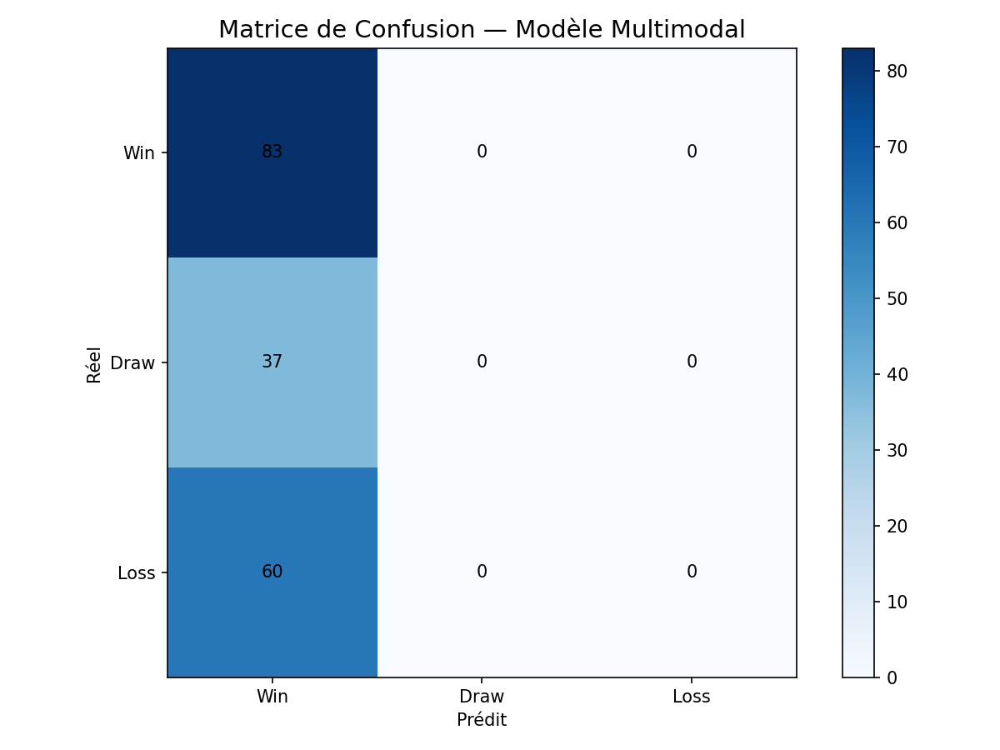

# Multimodal Sports Prediction

[]()
[]()
[]()

A late-fusion PyTorch pipeline for three-way football match prediction (home win / draw / away win), combining a sequential encoder over rolling match statistics with sentence-level text embeddings from `xlm-roberta-base`.

> **Read this first — status.** This repository is a **working pipeline, not a finished experiment.** It ships an end-to-end runnable demo on *synthetic* match data. That synthetic data contains no learnable signal by construction (see [Honest results](#honest-results)), so the demo run cannot and does not beat a majority-class baseline. Reproducing a real result requires real match data and generated text embeddings; those results are not in this repository.

## Architecture

```
rolling match stats  ──▶  LSTM encoder  ──┐
  [seq_len=5, 8 features]                 ├──▶  concat ──▶ MLP head ──▶ 3-way softmax
match-adjacent news  ──▶  xlm-roberta ────┘
  [CLS, 768-dim]           Linear 768→256→128
```

The 8 statistical features per match, computed **only from matches before kickoff**:
`home_form`, `home_goals_scored`, `home_goals_conceded`, `home_elo`, and the four away equivalents. Form and goal averages use a 5-match rolling window; ELO is computed sequentially in date order with a home-advantage term.

Each match is paired with the text embedding of the nearest news article within a configurable window (default 30 days). Matches with no article in range receive a zero vector.

## Methodology notes

- **Chronological splits.** Train/validation/test are split by date, never randomly, so no future information leaks into training. ELO and rolling form are computed sequentially in match order for the same reason.
- **Zero-vector fallback is a real risk.** If the embedding files are missing, every NLP vector is zero and the model silently degrades to stats-only while still calling itself multimodal. The pipeline now prints a loud warning in that case — do not report such a run as a multimodal result.

## Honest results

Running `python src/main.py` in demo mode produces:

| Metric | Value |
|---|---|
| Test accuracy | 0.46 (83/180) |
| Macro F1 | 0.21 |
| Win | precision 0.46, recall 1.00 |
| Draw | precision 0.00, recall 0.00 |
| Loss | precision 0.00, recall 0.00 |



The model predicts **Win for all 180 test matches** and scores exactly the base rate.

This is the correct outcome for this data. `src/stats/generate_demo_stats.py` generates match scores as:

```python
home_score = np.random.choice([0,1,2,3,4,5], p=[0.18, 0.30, 0.28, 0.15, 0.07, 0.02])
away_score = np.random.choice([0,1,2,3,4,5], p=[0.25, 0.33, 0.24, 0.12, 0.05, 0.01])
```

— drawn independently of which teams are playing. The features therefore carry **zero** information about the label, and collapsing to the majority class is the optimal strategy. The demo exists to prove the pipeline runs, not to demonstrate predictive skill. Any comparison of "multimodal vs stats-only" on this data measures nothing.

To get a meaningful result you need real match data (`src/stats/fetch_data.py`, requires a football-data.org key) and generated embeddings (`src/nlp/nlp_train.py`).

## Setup

```bash
pip install -r requirements.txt
cp .env.example .env   # then add your football-data.org API key
```

A free key is available at [football-data.org](https://www.football-data.org/client/register). Scripts that need it now fail with a clear message rather than falling back to a bundled key.

## Running

Demo pipeline, no credentials or downloads required — synthetic data, end to end:

```bash
python src/main.py
```

Generate text embeddings (downloads ~5,900 articles from the Transfermarkt news archive on Hugging Face and runs `xlm-roberta-base` over them; several minutes on CPU):

```bash
python src/nlp/nlp_train.py
```

Fetch real match data (requires `FOOTBALL_DATA_API_KEY`):

```bash
python src/stats/fetch_data.py
```

Interactive checks:

```bash
python test.py --all
```

## Repository structure

```text
src/
  main.py                      end-to-end demo pipeline
  models/
    fusion_model.py            late-fusion architecture, training loop, predict_match()
    fusion_dataloader.py       dataset, date-based article matching, chronological splits
  nlp/
    nlp_train.py               generates data/historical_embeddings.pt
    roberta_model.py           embedding utilities
    scraper.py                 RSS headline collection
  stats/
    generate_demo_stats.py     synthetic demo data + feature engineering (ELO, form)
    fetch_data.py              football-data.org ingestion
    preprocessing.py           feature assembly
    merge_sources.py           joins statistical and text sources
predict.py                     single-match inference
test.py                        interactive pipeline checks
```

Datasets and generated embeddings live in `data/` and are git-ignored.

## Limitations

- Demo data is synthetic noise; no real predictive result is committed to this repository.
- No betting, odds, or staking logic exists here. Any expected-value or ROI figure quoted elsewhere is **not** reproducible from this code and should not be attributed to it.
- The text branch matches articles to matches by date proximity only — the nearest article is not necessarily *about* either team.
- Single train/val/test split, single seed; no cross-validation or confidence intervals.
- `src/models/multimodal_v1.pth` and `lstm_v1.pth` are checkpoints from demo runs and carry no predictive value.

## License

MIT — see [LICENSE](LICENSE).
