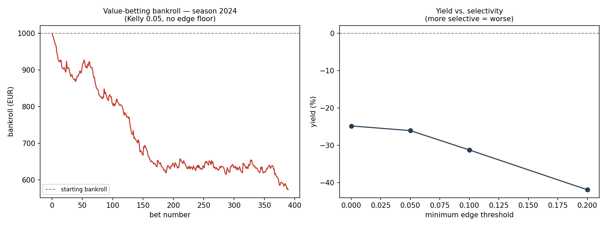

# Multimodal Sports Prediction

[]()
[]()
[]()

A late-fusion PyTorch pipeline for three-way football match prediction (home win / draw / away win), combining a sequential encoder over rolling match statistics with sentence-level text embeddings from `xlm-roberta-base`.

Two evaluation paths are included: a real-data pipeline benchmarked against Bet365 closing odds ([Results](#results)), and a synthetic-data smoke test that runs end-to-end with no credentials ([Demo mode](#demo-mode)).

## Architecture

```
rolling match stats  ──▶  LSTM encoder  ──┐
  [seq_len=5, 8 features]                 ├──▶  concat ──▶ MLP head ──▶ 3-way softmax
match-adjacent news  ──▶  xlm-roberta ────┘
  [CLS, 768-dim]           Linear 768→256→128
```

The 8 statistical features per match, computed **only from matches before kickoff**:
`home_form`, `home_goals_scored`, `home_goals_conceded`, `home_elo`, and the four away equivalents. Form and goal averages use a 5-match rolling window; ELO is computed sequentially in date order with a home-advantage term.

Each match is paired with the text embedding of the nearest news article within a configurable window (default 30 days). Matches with no article in range receive a zero vector.

## Methodology notes

- **Chronological splits.** Train/validation/test are split by date, never randomly, so no future information leaks into training. ELO and rolling form are computed sequentially in match order for the same reason.
- **Zero-vector fallback is a real risk.** If the embedding files are missing, every NLP vector is zero and the model silently degrades to stats-only while still calling itself multimodal. The pipeline now prints a loud warning in that case — do not report such a run as a multimodal result.

## Results

Held-out season 2024/25 (504 Premier League matches), trained on 2015/16–2023/24.
Every number below is produced by `src/models/evaluate_strategy.py` and stored in
`results/strategy_evaluation.json`.

### Model quality

Feature matrix is 2,326-dimensional: 20 tabular features (rolling form, head-to-head,
season points) + 2,304 historical team-embedding features + 2 news-sentiment features.
Model selection is by log-loss rather than accuracy, since calibrated probabilities are
what the staking rule consumes.

| Model | Accuracy | Log-loss |
|---|---|---|
| **MLP (128, 64)** | **54.17%** | **0.9723** |
| Logistic regression | 52.98% | 0.9807 |
| Random forest | 52.78% | 0.9981 |
| Gradient boosting | 51.79% | 1.0052 |

Benchmarked against the market on the same 504 matches:

| | Log-loss | Accuracy |
|---|---|---|
| Uniform prior | 1.0986 | — |
| **This model (MLP)** | **0.9723** | 54.17% |
| Bet365 closing odds, de-vigged | 0.9427 | 55.95% |

The model is well clear of the uniform baseline and lands within 0.030 nats of the
de-vigged closing line — but the bookmaker is still better on both metrics. Mean
overround across the season is 5.44%.

### Betting simulation

Value bets are placed when `P_model > 1/Odds`, staked by fractional Kelly.

| Kelly | Min edge | Bets | ROI | Yield | Win rate | Max drawdown |
|---|---|---|---|---|---|---|
| 0.05 | 0.00 | 389 | −42.70% | −24.82% | 32.4% | 42.7% |
| 0.05 | 0.05 | 361 | −43.06% | −26.06% | 29.9% | 43.1% |
| 0.05 | 0.10 | 299 | −43.80% | −31.25% | 25.1% | 43.8% |
| 0.05 | 0.20 | 194 | −44.05% | −41.92% | 17.5% | 44.0% |
| 0.10 | 0.00 | 417 | −67.60% | −26.44% | 33.6% | 67.6% |
| 0.25 | 0.00 | 379 | −94.50% | −33.23% | 33.2% | 94.5% |



**The strategy does not beat the market.** Two things drive this, and the second is the
more interesting one:

1. The model's probabilities are worse-calibrated than the de-vigged closing line
   (0.9723 vs 0.9427). Betting into a better-informed counterparty loses the overround
   by construction.
2. **Yield gets monotonically worse as the edge threshold rises** — from −24.8% at no
   floor to −41.9% at a 20% floor. If the model held genuine edge, filtering to its
   highest-confidence disagreements with the market should *improve* yield. It does the
   opposite, which says those large apparent edges are miscalibration, not signal.

Being close to the closing line on log-loss is a respectable result for a model built
from public match statistics and news text. Being close is not the same as being ahead,
and only being ahead is profitable.

### Scaled-up model and market efficiency

The baseline above trains on one league. `src/models/model_v2.py` scales it to **14 European
leagues and 37,514 matches**, replaces goals-only features with shot-based venue-split rolling
windows (shots, shots on target, corners, rest days), and — critically — supplies the de-vigged
opening price as an input feature.

That last choice makes the test decisive: a model handed the market's own probabilities starts
from everything the price knows, so any improvement must be information the market lacks.

| Market | Split | Model log-loss | Market log-loss | Difference |
|---|---|---|---|---|
| 1X2 | validation 2023/24 | 0.9942 | 0.9923 | +0.0018 |
| 1X2 | test 2024/25 | 1.0016 | 1.0006 | +0.0010 |
| Over/Under 2.5 | test 2024/25 | 0.6756 | 0.6756 | −0.00004 |

The gap to the closing line narrowed from **+0.0296** in the baseline to **+0.0010** — parity —
but never turned negative. Given the price plus 22 additional features and 26,674 training
matches, the model converges to reproducing the market and loses a little to estimation error.
The Over/Under market behaves identically.

**Conclusion: the feature set carries no information not already in the price.**

### Why value betting loses

Decomposed on the 5,429-match test set (flat stakes, overround 6.30%):

| Strategy | Yield per bet | Hit rate |
|---|---|---|
| Random selection | −7.53% | 33.3% |
| Model, highest probability | −5.70% | 50.3% |
| Model, highest EV | −4.34% | 31.8% |

The model beats random by ~1.8 points, so it has genuine skill — just not the 6.3 points needed
to clear the overround. The larger problem is *which* bets the EV rule selects:

| Odds bucket | n | EV claimed | Actual yield | Hit rate |
|---|---|---|---|---|
| 1–2 | 728 | −2.6% | −6.0% | 54.4% |
| 2–3 | 1,032 | −1.4% | −5.3% | 39.6% |
| 3–5 | 2,877 | +0.2% | −0.1% | 28.6% |
| 5–10 | 605 | +5.5% | −12.5% | 14.2% |
| 10–100 | 187 | **+28.6%** | **−32.1%** | 4.8% |

Because edge is `p·odds − 1`, a fixed absolute error in `p` scales with the odds: a 3-point
overestimate implies a +20% edge at odds 15 but only +2% at odds 1.5. Selecting on maximum edge
therefore selects wherever the model's estimates are most inflated, and Kelly sizes exactly those
bets largest. This is why tightening `min_edge` makes yield *worse* (−24.8% → −41.9%) and why
ROI degrades far faster than yield as the Kelly fraction rises.

Notably the Over/Under market yields −0.75% at the same EV≥0 rule versus −24.8% for 1X2: prices
near even money leave no room for the amplification effect.

## Demo mode

`python src/main.py` runs the full pipeline end-to-end on synthetic data with no
credentials or downloads required. Note that `src/stats/generate_demo_stats.py` draws
match scores independently of the teams involved, so the demo data carries no signal and
the model correctly collapses to the majority class (46% accuracy = the base rate). It is
a smoke test for the pipeline, not an experiment — use the real-data path above for
results.

## Setup

```bash
pip install -r requirements.txt
cp .env.example .env   # then add your football-data.org API key
```

A free key is available at [football-data.org](https://www.football-data.org/client/register). Scripts that need it now fail with a clear message rather than falling back to a bundled key.

## Running

Demo pipeline, no credentials or downloads required — synthetic data, end to end:

```bash
python src/main.py
```

Generate text embeddings (downloads ~5,900 articles from the Transfermarkt news archive on Hugging Face and runs `xlm-roberta-base` over them; several minutes on CPU):

```bash
python src/nlp/nlp_train.py
```

Fetch real match data (requires `FOOTBALL_DATA_API_KEY`):

```bash
python src/stats/fetch_data.py
```

Tests (no torch or downloads required — `pip install -r requirements-test.txt`):

```bash
pytest tests/
```

They cover the Kelly staking maths against its closed form, value-bet detection,
de-vigging, and — importantly — that feature construction cannot see the current or any
future match. A look-ahead bug is silent and flatters results, so it is asserted directly.

Interactive checks:

```bash
python test.py --all
```

Full real-data evaluation (downloads results + odds, trains, backtests):

```bash
python src/models/train_model.py --matches matches_PL.csv \
    --historical-embeddings data/historical_embeddings.pt \
    --news-embeddings data/news_embeddings.pt \
    --model auto --test-season 2024 \
    --output-predictions predictions.csv

python src/models/evaluate_strategy.py --test-season 2024 --predictions predictions.csv
```

## Repository structure

```text
src/
  main.py                      end-to-end demo pipeline
  models/
    fusion_model.py            late-fusion architecture, training loop, predict_match()
    fusion_dataloader.py       dataset, date-based article matching, chronological splits
    train_model.py             tabular + embedding features, model comparison, exports predictions
    backtesting.py             value-bet detection, fractional Kelly, ROI/yield/drawdown metrics
    evaluate_strategy.py       model vs. de-vigged market + staking grid -> results/
    model_v2.py                14-league scaled model, shot features, market-anchored
    closing_line_value.py      CLV test with random-selection control
  nlp/
    nlp_train.py               generates data/historical_embeddings.pt
    roberta_model.py           embedding utilities
    scraper.py                 RSS headline collection
  stats/
    generate_demo_stats.py     synthetic demo data + feature engineering (ELO, form)
    fetch_data.py              football-data.org ingestion
    preprocessing.py           feature assembly
    merge_sources.py           joins statistical and text sources
tests/
  test_backtesting.py          Kelly staking, value detection, settlement, metrics
  test_features.py             de-vigging + look-ahead guarantees
predict.py                     single-match inference
test.py                        interactive pipeline checks
```

Datasets and generated embeddings live in `data/` and are git-ignored.

## Limitations

- Demo data is synthetic noise; no real predictive result is committed to this repository.
- Results are from a single held-out season (504 matches) with one seed — no cross-season variance estimate or confidence intervals.
- The simulation assumes every bet is placed at the listed closing price with unlimited liquidity and no account limits, which overstates achievable returns.
- The text branch matches articles to matches by date proximity only — the nearest article is not necessarily *about* either team.
- Single train/val/test split, single seed; no cross-validation or confidence intervals.
- `src/models/multimodal_v1.pth` and `lstm_v1.pth` are checkpoints from demo runs and carry no predictive value.

## License

MIT — see [LICENSE](LICENSE).
